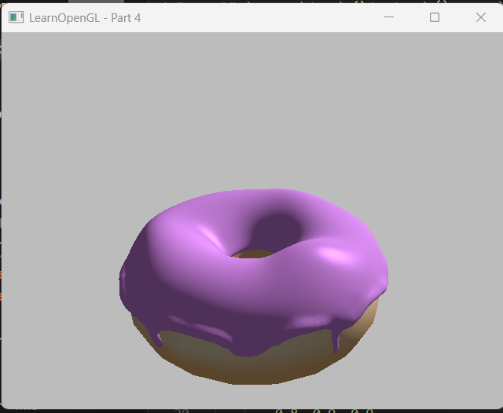

# Hi, I'm Sofia!

<!-- banner -->

🌠 I'm a multi-faceted software engineer with extensive experience and passion for full-stack and game development. 

👾 I enjoy exploring the intersection of art and technology from machine learning to computer graphics. 

🌊 Currently a Computer Science student at UC San Diego, class of 2026. 

## 🛠 Tech Stack

  
<!-- Languages -->
  
  
  
  
  
  
  
  

  
  
  
  
  
  

## 🔍 Preview My Projects
<!-- Computer Graphics Blender GIF -->
💫 Computer Graphics
> I learned the mechanisms and math behind graphics engines and rendered 2D & 3D models with OpenGL, Blender, and Shadertoy. (My profile photo is a scene I modeled and rendered myself!)

  
   

 

<!-- BTT Project -->
🤖 Search Query Recommender System
> A team of AI/ML Fellows and I were tasked to enhance the Google search experience by providing query autocompletion.  We utilized the GPT2 and DistilRoBERTa-base model.  Read more [here](https://github.com/harsita-keerthi/btt-google-2e) !

  

 

<!-- Game -->
🐭 The Great Mouse Performance
> For [MelonJam 5](https://itch.io/jam/melonjam5), I worked with an engineer and designer to create a one-level 3D rhythm game with Unity, inspired by that piano scene in Tom & Jerry called **The Great Mouse Performance**. Play it [here](https://frndlydragon.itch.io/the-great-mouse-performance) !

  
   
  <i align="center">Above is the game page art, designed by me!</i>

 

<!-- Full-Stack -->
 Purrfect Notes
> For a quarter long project, I was a full-stack developer on a team of 12.  Together, we created a developer desktop app for fellow engineers to create and organize their meeting notes and thoughts in an elegant yet simple way. [Try it out](https://github.com/cse110-sp24-team24/cse110-sp24-team24) ! Or click the image below to watch the demo video !

## Connect with me!

<!--

Here are some ideas to get you started:

- 🔭 I’m currently working on ...
- 🌱 I’m currently learning ...
- 👯 I’m looking to collaborate on ...
- 🤔 I’m looking for help with ...
- 💬 Ask me about ...
- 📫 How to reach me: ...
- 😄 Pronouns: ...
- ⚡ Fun fact: ...
-->
